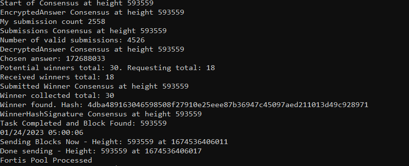
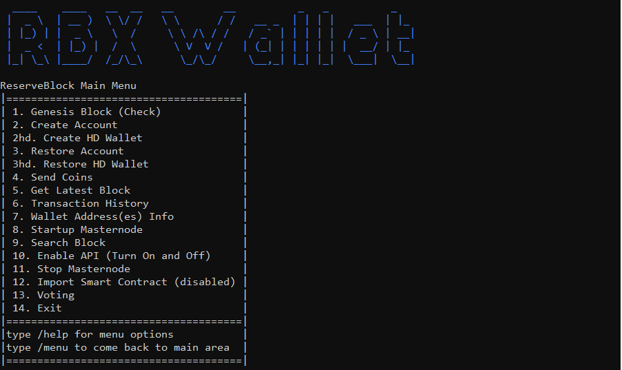

# RBX Adjudicators

## Summary

The purpose of the document is to go over the adjudicators, how to request a vote to become, and what happens when you become one. Please note with this process you are never needed to expose your private key to the wallet or anywhere outside your own building application.

If you have any issues please reach out to the community through discord or your respective telegram channels.

- #### [Discord](https://discord.com/invite/PnS2HRETDh)

- #### [Website](https://www.reserveblock.io/)

- #### [Explorer](https://rbx.network/)

Becoming an adjudicator is something open to all. This document will describe the steps in what must be done to become an adjudicator as well as the requirements to be voted in as one.

## First off, what is an adjudicator?

An adjudicator is part of the validation life cycle and acts as another checks and balances system for the network without any award incentives. Adjudicators are voted in by their peers (validators) as well as nominated by them.

The adjudicators are responsible for getting all the task submissions from validators, they validate those submissions, and then through consensus choose a winner at random in a rotating run. Adjudicators are not aware of the winning results and therefore cannot show favoritism to any one validator.

Adjudicators also help in the distribution of TXs to validators so they can be compiled into blocks. Adjudicators only allow one unique IP and Address to run through validation at any point in time.

## Do adjudicators get rewards?

No. Adjudicators are designed to be purely altruistic to the network.

Because of this no rewards are given to them. This is to keep that altruism, but also to give them no incentive to act malicious as there would be no reward and since they are in a consensus with other adjudicators they cannot sway the vote of the winner either by only choosing validator submissions they like.

## Is there a limit to adjudicators?

No. There can be theoretically an infinite number of adjudicators.

They are selected to perform consensus in decentralized quorum and benches are created to ensure no disruption ever happens should an adjudicator be offline for whatever reason.

## Can someone lose the right to adjudicate?

Yes. Adjudicator spots are not guaranteed once voted in.

Adjudicators can be removed in two ways. Either through voting by the validators, or by a ban from the internal adjudicators for poor performance, missed consensus runs, or any level of disruptions that may threaten the network.

## Does an adjudicator run on separate software like other blockchains do with some processes?

No. Every process for adjudicating runs through the native CLI. No extra software is needed.

## How does an adjudicator get voted in or out?

A validator must submit a topic where they propose why an adjudicator should be voted in or out. If that vote reaches a 51% majority then the vote is considered a pass and the new adjudicator's address is added to the bench signers. The opposite happens if they are voted out. They would be removed from the signers' locale and no longer recognized as an adjudicator.

Should a vote note reach a 51% then it is considered a failed vote and nothing will happen.

## How do I propose a vote?

Votes can be submitted through the GUI and CLI. Votes through the CLI can be accessed through the voting program.

To access the voting program type /vote and press enter. This will open the voting program where you can create a topic and send it in for submission. Option 1 and enter will let you create a topic. You would simply select the AdjVoteIn, or AdjVoteOut to create an Adjudicator vote.

You can also use the voting API to submit a topic. The API endpoint would be:
http://localhost:7292/voapi/vov1/PostNewTopic

## Are there requirements for proposing an adjudicator?

Yes.

The requirements for adjudicator consideration are as followed:

- HDD space of 200GB
- Internet Speed (Up/Down) 100 MB/s
- CPU Core of 6
- CPU Threads of 10
- RAM of 16 GB
- Bandwidth of 16 TB
- A Technical background writeup
- A Reason for the voting of the proposed ADJ

The requirements are to ensure the adjudicator can run at optimal performance, but also have room to grow as network demands increase.

## What do I do once voted in?

Nothing. Once voted in the network of validators will automatically add you as a signer and your wallet will convert to an adjudicator wallet. Please note an adjudicator wallet can do nothing else but adjudicate. It should not send funds, receive, or perform any other task as it may risk their participation in the consensus run.

## What happens if my private key for adjudicating is compromised?

This would leave the current pool of adjudicators no choice but to permanently remove you from the signers forever.

There is also an IP restriction, so this will protect the network, but a compromised key can never be trusted again.

## What are the steps to adjudicating in the CLI?

These are the following steps to adjudicating from the CLI from start to finish (after voting has occurred):

1. Have the RBX address associated with the wallet.
2. Once your signer's block height start point has been hit you are considered a valid signer.
3. The wallet will enter adjudication mode automatically with no user input needed.
4. From here the wallet just needs to be left running and not used for any other purposes.

## Do I need to have any ports open for this?

Yes. You must have port 3338 open to adjudicate.

## Do Peers connect to adjudicators for blocks and other P2P functions?

No. Adjudicators only connect to other adjudicators, and only allow validators to connect in through the ADJ p2p functions which are limited to validating tasks only.

## What does the ADJ process look like?

The following is a screenshot of what the wallet does while adjudicating:
  
**VS the standard CLI**

## How do I get help if needed?

If any of the above instructions are not working or if you are having issues it is recommended to reach out to the community discord. There are numerous devs and community members who would be happy to help. Link is above on the first page.
